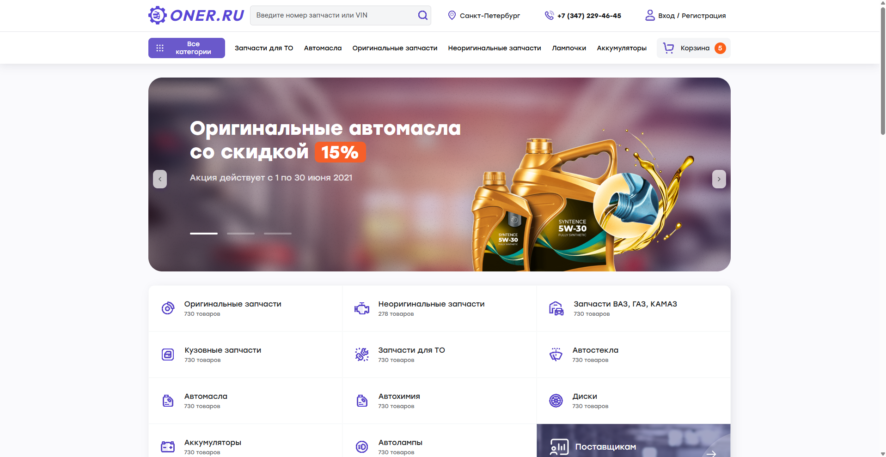

# ONER.RU — магазин автозапчастей

Десктопная вёрстка главной страницы интернет-магазина: шапка с поиском и
корзиной, промо-баннер, сетка категорий, карточки товаров с рейтингом и
ценой, подвал со способами оплаты.

**[Открыть демо →](https://alonaborealis.github.io/auto-shop/)**



## Стек

- Семантическая вёрстка, HTML5
- SCSS: переменные, базовые стили и один файл секций на 1000+ строк
- Подключены лицензионные шрифты Stolzl и TT Commons — форматы woff2 и woff,
  по одному `@font-face` на начертание
- Sass для сборки, Prettier

## Особенности

Макет свёрстан без готовых сеточных фреймворков — раскладка собрана на
flexbox и grid вручную. Карточки товаров и плитки категорий тянутся по
ширине контейнера, сохраняя пропорции.

Мобильной версии и интерактива пока нет: это чистая десктопная вёрстка.

## Локальный запуск

```
npm install
npm run sass-watch
```

Дальше открыть `index.html` в браузере. Стили пересобираются на лету.
